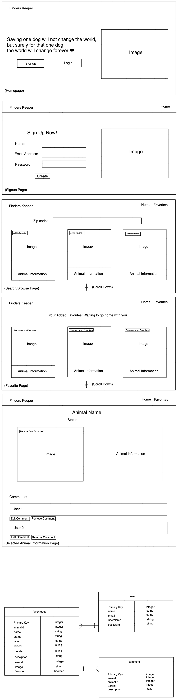

# Finders Keeper
Finders Keeper is an app to help people search for adoptable pets near them. The goal of this app is to help people find their forever soulpet(s). 

## Tech Stack Used
* Axios 
* Express 
* Ejs
* Ejs-layouts
* Sequelize 
* Method-override

## Wireframes and ERD


## API
https://www.petfinder.com/developers/v2/docs/

## Accessing API
* To access PetFinder API, I must receive the APIKEY AND APISECRET first, then use 
```js
  const params = new URLSearchParams();
  params.append('grant_type', 'client_credentials');
  params.append('client_id', petFinderKey);
  params.append('client_secret', petFinderSecret);
  axios.post(`https://api.petfinder.com/v2/oauth2/token`, params)
    .then(accessToken => {
      const header = "Bearer " + accessToken.data.access_token;
      const options = {
        method: 'GET',
        headers: { 'Authorization': header },
        url: "https://api.petfinder.com/v2/animals?type=dog&page=2"
      }
      axios(options)
        .then((response) => {
          let animals = response.data.animals
          res.render('index', { animals: animals })
        })
        .catch(error => {
          console.log(error)
        })
    })
    .catch(error => {
      console.log(error)
    })
```

